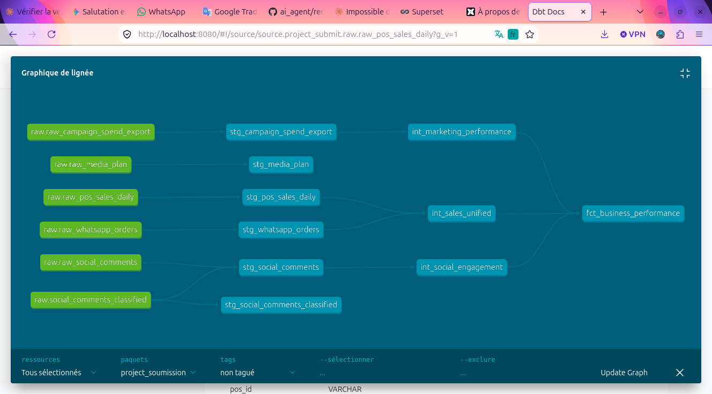
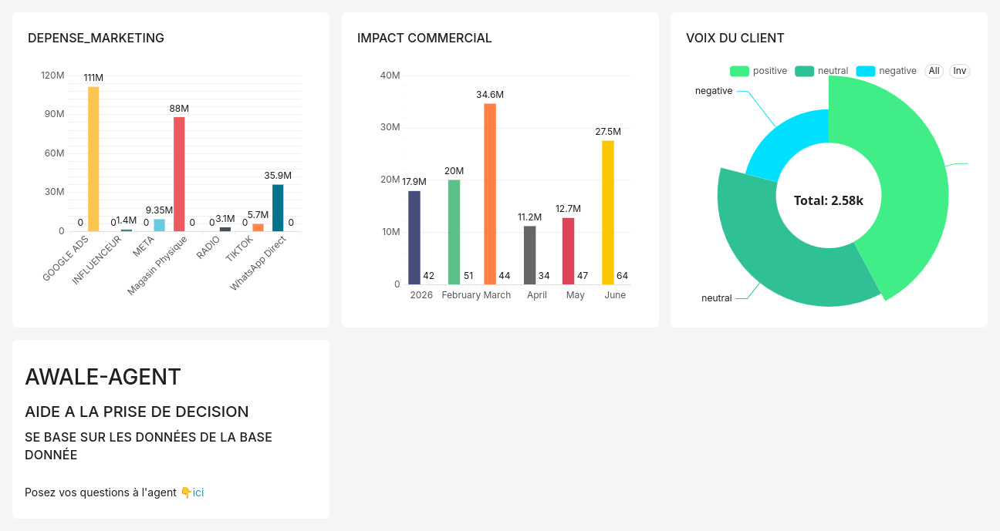
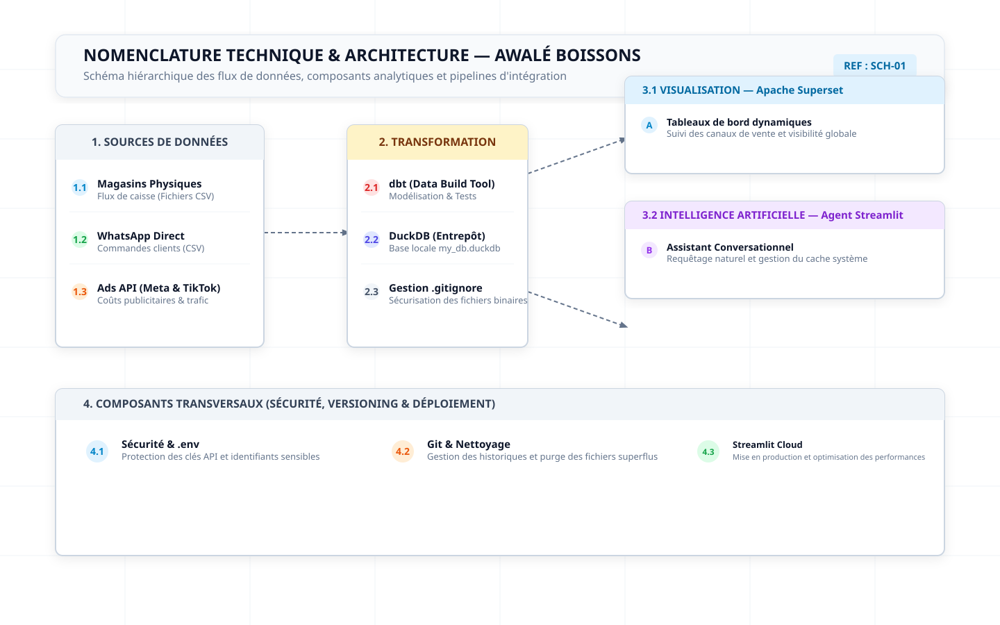

# 🚀 Awalé Boissons — Plateforme Décisionnelle & Agent AI Unifié

> **Documentation Technique & Guide Complet du Projet** — Centralisation, transformation des données, intelligence décisionnelle et agent conversationnel intelligent.

---

## 📋 Table des Matières
1. [Explication & Conception du Projet](#1-explication--conception-du-projet)
2. [Architecture Technique](#2-architecture-technique)
3. [Guide d'Installation & Configuration](#3-guide-dinstallation--configuration)
4. [Étapes de Nettoyage & Data Quality (dbt)](#4-étapes-de-nettoyage--data-quality-dbt)
5. [Guide d'Utilisation d'Apache Superset & Résolution des Contours](#5-guide-dutilisation-dapache-superset--résolution-des-contours)
6. [Déploiement de l'Agent sur Streamlit Cloud](#6-déploiement-de-lagent-sur-streamlit-cloud)
7. [Difficultés Rencontrées & Solutions](#7-difficultés-rencontrées--solutions)

---

## 🎯 1. Explication & Conception du Projet

**Awalé Boissons** est une solution d'ingénierie des données et de Business Intelligence (BI) de bout en bout conçue pour répondre à un double enjeu stratégique :
* **Unifier les données hétérogènes** : Consolider les sources de ventes physiques (magasins), les canaux de conversion directe (WhatsApp Direct) et les investissements publicitaires digitaux (TikTok & Meta).
* **Démocratiser l'accès aux insights** : Offrir aux équipes métier un tableau de bord analytique visuel (Apache Superset) couplé à un assistant conversationnel intelligent (Streamlit & LangChain) capable de répondre en langage naturel à des questions complexes sur les performances.

---

## 🏗️ 2. Architecture Technique

```text
[Sources Brutes / Fichiers EXCEL]
       │
       ▼ (extension DuckDB "spatial" chargée dans un hook dbt : INSTALL spatial; LOAD spatial;)
[DuckDB (Entrepôt local)] ──> stg_models ──> fct_business_performance
       │
       ├──> [Apache Superset] (Visualisation & Tableaux de bord décisionnels)
       └──> [Streamlit + LangChain Agent] (Text-to-SQL en langage naturel)
```

* **Stockage & Moteur Analytique** : DuckDB (léger, rapide, embarqué).
* **Transformation des données** : dbt (Data Build Tool), avec lecture directe des fichiers Excel via l'extension DuckDB `spatial` (`st_read`), puis `dbt run` et `dbt test`.
* **Visualisation** : Apache Superset (Dashboards décisionnels).
* **Intelligence Artificielle** : Agent Streamlit connecté à DuckDB via LangChain.

---

## ⚙️ 3. Guide d'Installation & Configuration

### Prérequis
* Python 3.10+
* Git
* **Docker & Docker Compose** (requis pour Superset)
* [uv](https://docs.astral.sh/uv/) (gestionnaire de projet Python)
* Environnement virtuel Python

### Étape A : Clonage et Configuration de l'Environnement

```bash
# 1. Cloner le dépôt
git clone https://github.com/essbony/project_submit.git
cd project_submit

# 2. Créer et activer l'environnement virtuel
python3 -m venv .venv

# Linux / macOS
source .venv/bin/activate
# Windows (PowerShell)
.venv\Scripts\Activate.ps1

# 3. Installer les dépendances du projet racine
uv pip install -r requirements.txt
```

### Étape B : Configuration des Secrets (`.env`)

Créez un fichier `.env` à la racine du projet contenant vos clés d'API :


### Étape C : Lancer l'Agent Awalé (Streamlit)

```bash
cd awale_agent/
uv pip install -r requirements.txt
streamlit run app.py
```
🔗 Version déployée : https://awale-agent.streamlit.app/

### Étape D : Exécuter le Pipeline dbt

```bash
cd dbt/
dbt run && dbt test
```
> L'extension DuckDB `spatial` est chargée automatiquement au début de l'exécution (via un hook dbt) pour lire directement les fichiers Excel sources — aucune commande d'installation manuelle n'est nécessaire.

### Étape E : Lancer Superset

```bash
cd superset_local/
uv pip install -r requirements-local.txt

# Première utilisation uniquement (build des images + création des conteneurs)
docker compose up -d --build

# Utilisations suivantes (conteneurs déjà créés)
docker compose start
```

---

## 🧹 4. Étapes de Nettoyage & Data Quality (dbt)

Le pipeline dbt garantit la propreté, l'unicité et la validité des données avant leur exposition dans Superset.

### Ordre d'exécution obligatoire :
1. **Extension `spatial` (`st_read(...)`)** : chargée en hook au début de `dbt run`, lit directement les fichiers Excel statiques de référence et de mapping dans DuckDB.
2. **`dbt run`** : exécute les modèles de staging et les marts analytiques (`fct_business_performance`).
3. **`dbt test`** : valide l'intégrité des données (tests d'unicité sur les `comment_id`, non-nullité des clés).

Commandes d'exécution :
```bash
cd dbt/
dbt run
dbt test
cd ..
```

---

## 📊 5. Guide d'Utilisation d'Apache Superset & Résolution des Contours

Superset sert de couche de restitution visuelle pour le pilotage commercial et marketing.

### Configuration du Tableau de bord (`[ VUE DECISIONNELLE ]`)
* **Connexion à DuckDB** : pointage vers la base de données locale/conteneurisée.
* **Modèle centralisé** : utilisation de la table `main_marts.fct_business_performance`.

### Résolution d'un contour critique (Visibilité des Canaux Marketing) :
* **Problème rencontré** : dans le graphique des dépenses marketing, seuls "Magasin Physique" et "WhatsApp Direct" apparaissaient, tandis que TikTok et Meta semblaient absents ou affichaient 0 en chiffre d'affaires.
* **Explication** : les plateformes digitales (TikTok / Meta) concentrent les investissements publicitaires (`marketing_spend_fcfa`) mais génèrent des conversions indirectes ou un suivi de notoriété (chiffre d'affaires à 0 dans cette table, contrairement aux canaux de vente directe).
* **Solution dans Superset** :
  1. Éditer le graphique de dépenses marketing (`Edit chart`).
  2. S'assurer que le champ **Group by** pointe bien sur `channel_or_platform`.
  3. Vérifier que la métrique sélectionnée est la somme de `marketing_spend_fcfa` pour que les barres de TikTok et Meta s'affichent correctement aux côtés des autres canaux.

---

## ☁️ 6. Déploiement de l'Agent sur Streamlit Cloud

Pour rendre l'agent IA accessible en ligne via Streamlit Cloud :

1. **Préparation du dépôt GitHub** :
   * Nettoyer les sous-dossiers `.git` internes pour éviter les liens bloqués sur GitHub.
   * Veiller à ce que `my_db.duckdb` soit ignoré via `.gitignore`.
2. **Configuration sur Streamlit Cloud** :
   * Connecter le dépôt GitHub `essbony/project_submit`.
   * Spécifier le fichier principal (ex: `awale_agent/app.py`).
3. **Gestion du cache en environnement Read-Only** :
   * Pour éviter l'erreur `sqlite3.OperationalError: attempt to write a readonly database`, configurer explicitement le chemin du cache LangChain vers `/tmp/llm_cache.sqlite` dans le code de l'agent ou les variables d'environnement de la plateforme.

## Schéma des modèles & dictionnaire de données

### Représentation visuelle (graphe de lignage dbt)

Le graphe complet des modèles est généré automatiquement via `dbt docs generate && dbt docs serve` (icône *Lineage Graph* en bas à droite de l'interface). Il montre les 4 couches du pipeline :

```
raw_*  (5 sources brutes, onglets du fichier Excel)
   │
   ▼
staging  (stg_campaign_spend_export, stg_media_plan, stg_pos_sales_daily, stg_whatsapp_orders, stg_social_comments, stg_social_comments_classified)
   │
   ▼
intermediate — ephemeral  (int_marketing_performance, int_sales_unified, int_social_engagement)
   │
   ▼
marts  (fct_business_performance)
```

> Les modèles intermediate sont matérialisés en `ephemeral` : ils n'apparaissent pas comme tables/vues dans DuckDB (aucun objet physique créé), seulement comme CTE injectés dans le SQL des marts — d'où leur absence de l'arborescence "Tables et vues" du catalogue, mais leur présence dans le graphe de lignage.



### Dictionnaire de données — `fct_business_performance`

Mart final consolidant les revenus nets et les dépenses marketing par mois et par canal pour la prise de décision.

| Colonne | Type | Description | Contrainte |
|---|---|---|---|
| `performance_month` | TIMESTAMP | Mois de la performance (clé temporelle) | not_null |
| `channel_or_platform` | VARCHAR | Nom du canal de vente ou de la plateforme publicitaire | not_null |
| `net_revenue_fcfa` | DOUBLE | Chiffre d'affaires net total en FCFA | not_null |
| `marketing_spend_fcfa` | DECIMAL(38,5) | Dépenses publicitaires totales en FCFA | not_null |
| `unique_customers` | BIGINT | Nombre de clients uniques sur la période | — |
| `total_comments` | BIGINT | Nombre total de commentaires reçus (réseaux sociaux) | — |
| `positive_comments` | BIGINT | Nombre de commentaires classés positifs | — |
| `négatif_comments` | BIGINT | Nombre de commentaires classés négatifs | — |
| `neutre_commentaires` | BIGINT | Nombre de commentaires classés neutres | — |
| `spam_comments` | BIGINT | Nombre de commentaires détectés comme spam | — |

> **Limite connue** : les colonnes `négatif_comments` et `neutre_commentaires` rompent la convention de nommage anglaise du reste du mart (`positive_comments`, `spam_comments`) — nommage à harmoniser en `negative_comments` / `neutral_comments` dans une prochaine itération.

# Usage de l'IA

* **Composant IA implémenté** : [agent Text-to-SQL (LangChain `SQLDatabase` + openai/gpt-4o via OpenRouter, interface Streamlit) interrogeant `fct_business_performance` en langage naturel].

## Temps passé

*Du 11 sept. au 17 sept*

| Phase | Temps estimé |
|---|---|
| Cadrage & exploration des données | 2 jours|
| Pipeline dbt (staging/intermediate/marts) |3 jours |
| Composant IA | 1H 10 min|
| Dashboard Superset | 10H|
| Documentation & livrables | 2H|
| **Total** | 5 jours 13H 10 min|

---


---

## 📊 Vue Décisionnelle




# Tech Stack



